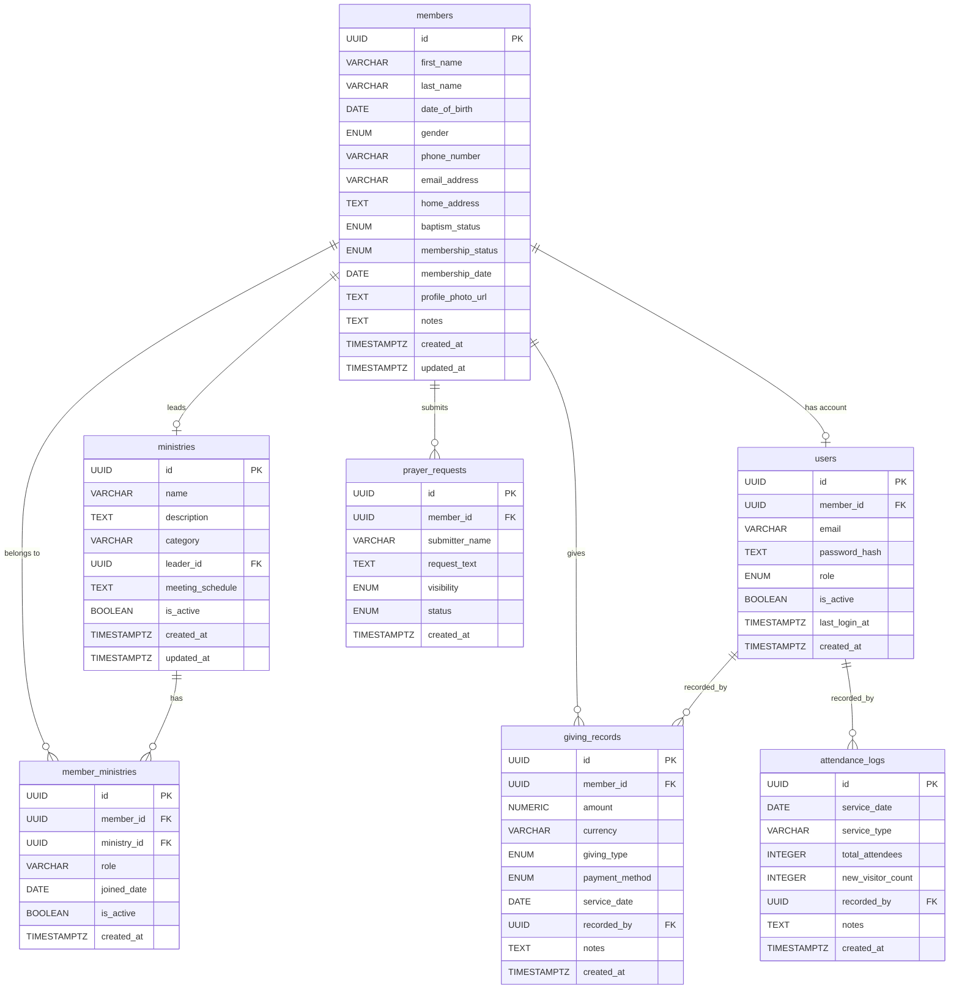
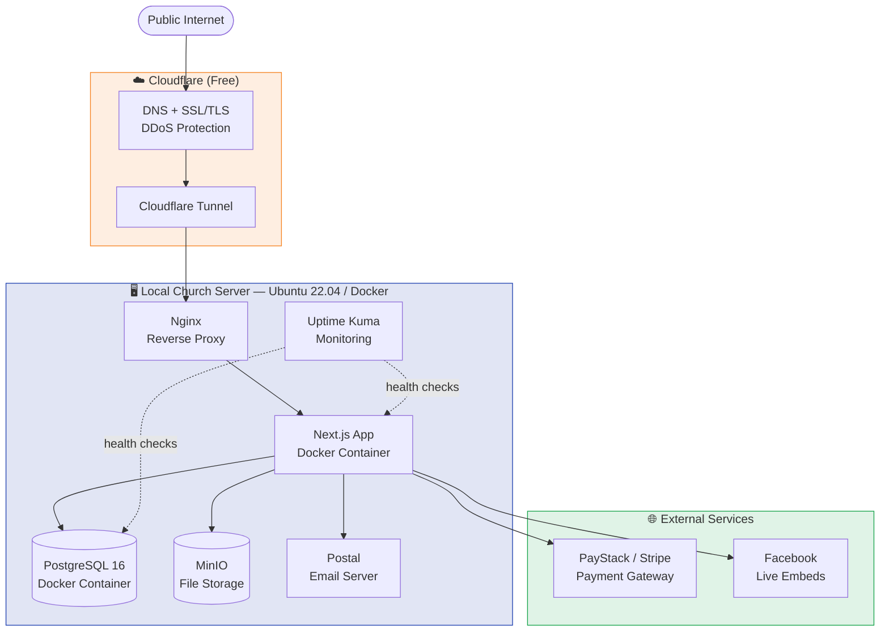

# Product Requirements Document
## Church Website & Member Management System

| | |
|---|---|
| **Project** | Church Website & Member Database |
| **Version** | 1.2 — Revised Draft |
| **Date** | June 2026 |
| **Tech Stack** | Custom-coded — React / Next.js (Self-Hosted) |
| **Status** | Draft — Pending Review |

---

## Table of Contents

1. [Introduction](#1-introduction)
2. [Goals & Objectives](#2-goals--objectives)
3. [Feature Requirements](#3-feature-requirements)
4. [Member Database Requirements](#4-member-database-requirements)
5. [Roles & Permissions](#5-roles--permissions)
6. [Technical Architecture](#6-technical-architecture)
7. [Feature Prioritisation](#7-feature-prioritisation)
8. [Project Timeline](#8-project-timeline)
9. [Open Questions & Assumptions](#9-open-questions--assumptions)
10. [Approval & Sign-Off](#10-approval--sign-off)

---

## 1. Introduction

### 1.1 Project Overview

This document outlines the product requirements for the design and development of a full-featured church website combined with an integrated member management database. The solution will serve as the primary digital presence for the church community, enabling members and visitors to access church information, engage with content, and manage their connection to the church.

### 1.2 Purpose

The church website aims to:

- Provide an accessible digital home for existing members and prospective visitors
- Showcase the church's mission, vision, activities, and service schedule
- Enable online engagement through giving, prayer requests, and event registration
- Offer a secure, centralised member database for church administration
- Facilitate communication between church leadership and the congregation

### 1.3 Scope

This PRD covers the following deliverables:

- Public-facing church website (Next.js frontend)
- Admin dashboard for content and member management
- Member database with role-based access
- Integrations for online giving, media, and notifications

### 1.4 Stakeholders

| Stakeholder | Role | Responsibilities |
|---|---|---|
| Super Admin | IT/Website Administrator | Full system access, user management, configuration |
| Pastor/Church Leader | Primary Decision Maker | Approve content, access member records, announcements |
| Church Members | Primary End Users | Access website, manage own profile, give online |
| Visitors/Public | Secondary Audience | Browse public site, explore church information |

---

## 2. Goals & Objectives

### 2.1 Business Goals

- Establish a professional, welcoming digital presence for the church
- Increase community engagement through online giving, media, and event participation
- Streamline member record management and reduce manual administrative workload
- Provide leadership with real-time visibility into membership and attendance

### 2.2 Success Metrics

| Metric | Baseline | Target (6 months) |
|---|---|---|
| Weekly website visitors | — | 500+ unique visitors |
| Online giving adoption | 0% | 30% of members |
| Member records digitised | 0% | 100% |
| Prayer requests submitted | — | 20+ per month |
| Sermon media plays | — | 200+ per month |

---

## 3. Feature Requirements

### 3.1 Public Website — Pages & Modules

#### 3.1.1 Landing Page (Homepage)

The homepage serves as the primary entry point and must create a strong first impression for both returning members and first-time visitors.

- Hero section with church name, tagline, and call-to-action buttons (Plan Your Visit, Give Online)
- Latest church activities feed — automatically pulled from the content CMS
- Quick-access cards linking to service schedule, events, and sermons
- Announcements banner for time-sensitive communications
- Responsive design — fully mobile-optimised

#### 3.1.2 Service Schedule

- Display of recurring weekly services (day, time, location/venue)
- Special service listing (Easter, Christmas, revivals)
- iCal / Google Calendar export option for individual services
- Editable by admin without code changes

#### 3.1.3 Mission & Vision

- Dedicated page with church mission statement, vision, and core values
- Leadership team profiles with photos, names, and roles
- Church history/about section

#### 3.1.4 New Visitor / First-Time Guest Page

- What to expect guide (service format, dress, duration, parking)
- FAQ section for common questions
- First-time guest registration form to capture contact details
- Welcome video embed (YouTube/Vimeo)

#### 3.1.5 Events & Calendar

- Full calendar view of upcoming church events and programmes
- Event detail pages (description, date/time, location, registration link)
- Online event registration form with capacity limits
- Email confirmation to registrants upon sign-up

#### 3.1.6 Sermon / Media Library

- Searchable library of past sermons (video, audio, or both)
- Filter by speaker, series, topic, or date
- Podcast RSS feed for sermon audio
- Sermon video files self-hosted via MinIO; Facebook Live stream links embeddable for live services

#### 3.1.7 Online Giving / Donations

- Secure giving form with options: tithe, offering, building fund, missions
- One-time and recurring donation setup
- Payment gateway integration (Stripe or PayStack recommended)
- Email receipt generation upon successful transaction
- Member giving history accessible from personal profile

#### 3.1.8 Prayer Request Form

- Public or member-only prayer submission form
- Option to mark request as public (shared with congregation) or private (leadership only)
- Admin inbox to manage, respond to, and archive requests
- Optional email notification to prayer team upon new submission

#### 3.1.9 Contact & Location Page

- Church address with embedded Google Maps
- General enquiry contact form
- Department contact directory (admin, pastoral, media, etc.)
- Social media links (Facebook, Instagram, YouTube)

---

## 4. Member Database Requirements

### 4.1 Database Schema

The database is built on **PostgreSQL 16**. The core schema consists of two primary tables — `members` and `ministries` — linked through a join table to support many-to-many ministry membership. Additional supporting tables cover users, attendance, giving, and prayer requests.

---

#### Table: `members`

Stores all personal, contact, and membership information for each church member.

| Column | Data Type | Constraints | Description |
|---|---|---|---|
| `id` | `UUID` | `PRIMARY KEY, DEFAULT gen_random_uuid()` | Unique member identifier |
| `first_name` | `VARCHAR(100)` | `NOT NULL` | Member's first name |
| `last_name` | `VARCHAR(100)` | `NOT NULL` | Member's last name |
| `date_of_birth` | `DATE` | `NOT NULL` | Date of birth |
| `gender` | `ENUM('Male','Female','Other')` | `NOT NULL` | Gender |
| `phone_number` | `VARCHAR(20)` | `NOT NULL` | Primary contact number |
| `email_address` | `VARCHAR(255)` | `UNIQUE, NOT NULL` | Email address (used for login) |
| `home_address` | `TEXT` | `NULLABLE` | Full residential address |
| `baptism_status` | `ENUM('Yes','No','Pending')` | `DEFAULT 'No'` | Whether the member has been baptised |
| `membership_status` | `ENUM('Active','Inactive','Visitor')` | `NOT NULL, DEFAULT 'Visitor'` | Current membership standing |
| `membership_date` | `DATE` | `NULLABLE` | Date formal membership was granted |
| `profile_photo_url` | `TEXT` | `NULLABLE` | Path to profile photo stored in MinIO |
| `notes` | `TEXT` | `NULLABLE` | Admin-only notes about the member |
| `created_at` | `TIMESTAMPTZ` | `DEFAULT NOW()` | Record creation timestamp |
| `updated_at` | `TIMESTAMPTZ` | `DEFAULT NOW()` | Last updated timestamp (auto-updated via trigger) |

**Indexes:**
- `idx_members_email` on `email_address`
- `idx_members_status` on `membership_status`
- `idx_members_last_name` on `last_name`

---

#### Table: `ministries`

Stores all church ministries and departments. Each ministry can have many members; each member can belong to many ministries.

| Column | Data Type | Constraints | Description |
|---|---|---|---|
| `id` | `UUID` | `PRIMARY KEY, DEFAULT gen_random_uuid()` | Unique ministry identifier |
| `name` | `VARCHAR(150)` | `NOT NULL, UNIQUE` | Ministry name (e.g. Worship Team, Ushers) |
| `description` | `TEXT` | `NULLABLE` | Brief description of the ministry's purpose |
| `category` | `VARCHAR(100)` | `NULLABLE` | Grouping (e.g. Worship, Administration, Outreach) |
| `leader_id` | `UUID` | `FK → members(id), NULLABLE` | Member assigned as ministry leader |
| `meeting_schedule` | `TEXT` | `NULLABLE` | Free-text description of when the ministry meets |
| `is_active` | `BOOLEAN` | `DEFAULT TRUE` | Soft-delete / archive flag |
| `created_at` | `TIMESTAMPTZ` | `DEFAULT NOW()` | Record creation timestamp |
| `updated_at` | `TIMESTAMPTZ` | `DEFAULT NOW()` | Last updated timestamp |

**Indexes:**
- `idx_ministries_name` on `name`
- `idx_ministries_leader` on `leader_id`

---

#### Table: `member_ministries` *(join table)*

Resolves the many-to-many relationship between members and ministries, and captures each member's role within a given ministry.

| Column | Data Type | Constraints | Description |
|---|---|---|---|
| `id` | `UUID` | `PRIMARY KEY, DEFAULT gen_random_uuid()` | Unique row identifier |
| `member_id` | `UUID` | `NOT NULL, FK → members(id) ON DELETE CASCADE` | Reference to the member |
| `ministry_id` | `UUID` | `NOT NULL, FK → ministries(id) ON DELETE CASCADE` | Reference to the ministry |
| `role` | `VARCHAR(100)` | `NULLABLE` | Member's role in this ministry (e.g. Leader, Volunteer) |
| `joined_date` | `DATE` | `NULLABLE` | Date the member joined this ministry |
| `is_active` | `BOOLEAN` | `DEFAULT TRUE` | Whether the member is currently active in this ministry |
| `created_at` | `TIMESTAMPTZ` | `DEFAULT NOW()` | Record creation timestamp |

**Constraints:**
- `UNIQUE(member_id, ministry_id)` — prevents duplicate ministry assignments

---

#### Table: `users`

Manages login credentials and system roles. Linked to `members` for authenticated church members, or standalone for admin-only accounts.

| Column | Data Type | Constraints | Description |
|---|---|---|---|
| `id` | `UUID` | `PRIMARY KEY, DEFAULT gen_random_uuid()` | Unique user identifier |
| `member_id` | `UUID` | `FK → members(id), NULLABLE` | Linked member record (null for admin-only accounts) |
| `email` | `VARCHAR(255)` | `NOT NULL, UNIQUE` | Login email |
| `password_hash` | `TEXT` | `NOT NULL` | Bcrypt-hashed password |
| `role` | `ENUM('super_admin','pastor','member')` | `NOT NULL, DEFAULT 'member'` | System access role |
| `is_active` | `BOOLEAN` | `DEFAULT TRUE` | Account enabled/disabled flag |
| `last_login_at` | `TIMESTAMPTZ` | `NULLABLE` | Timestamp of most recent login |
| `created_at` | `TIMESTAMPTZ` | `DEFAULT NOW()` | Account creation timestamp |

---

#### Table: `giving_records`

Records tithes and offerings entered manually by admins from physical tithe box collections. This is an admin-only data entry page — no online payment processing is involved in this table.

| Column | Data Type | Constraints | Description |
|---|---|---|---|
| `id` | `UUID` | `PRIMARY KEY, DEFAULT gen_random_uuid()` | Unique transaction identifier |
| `member_id` | `UUID` | `FK → members(id), NULLABLE` | Donor member (nullable for anonymous/unattributed gifts) |
| `amount` | `NUMERIC(10,2)` | `NOT NULL` | Amount given |
| `currency` | `VARCHAR(5)` | `NOT NULL, DEFAULT 'ZAR'` | Currency code |
| `giving_type` | `ENUM('Tithe','Offering','Building Fund','Missions','Other')` | `NOT NULL` | Category of donation |
| `payment_method` | `ENUM('Cash','EFT','Card','Cheque')` | `NOT NULL, DEFAULT 'Cash'` | How the donation was received |
| `service_date` | `DATE` | `NOT NULL` | Date of the service the giving relates to |
| `recorded_by` | `UUID` | `NOT NULL, FK → users(id)` | Admin who captured this record |
| `notes` | `TEXT` | `NULLABLE` | Optional admin notes |
| `created_at` | `TIMESTAMPTZ` | `DEFAULT NOW()` | Record creation timestamp |

**Indexes:**
- `idx_giving_member` on `member_id`
- `idx_giving_date` on `service_date`

---

#### Table: `attendance_logs`

Records headcount attendance per service. Tracks total attendees and new visitor counts — not linked to individual member records.

| Column | Data Type | Constraints | Description |
|---|---|---|---|
| `id` | `UUID` | `PRIMARY KEY, DEFAULT gen_random_uuid()` | Unique log entry |
| `service_date` | `DATE` | `NOT NULL` | Date of the service |
| `service_type` | `VARCHAR(100)` | `NOT NULL` | e.g. Sunday Main, Wednesday Bible Study, Good Friday |
| `total_attendees` | `INTEGER` | `NOT NULL, DEFAULT 0` | Total headcount for the service |
| `new_visitor_count` | `INTEGER` | `NOT NULL, DEFAULT 0` | Number of first-time visitors recorded at the service |
| `recorded_by` | `UUID` | `FK → users(id), NULLABLE` | Admin who logged the attendance |
| `notes` | `TEXT` | `NULLABLE` | Optional notes (e.g. special service, weather impact) |
| `created_at` | `TIMESTAMPTZ` | `DEFAULT NOW()` | Record creation timestamp |

**Constraints:**
- `UNIQUE(service_date, service_type)` — one headcount entry per service per day

---

#### Table: `prayer_requests`

Stores prayer requests submitted by members or visitors.

| Column | Data Type | Constraints | Description |
|---|---|---|---|
| `id` | `UUID` | `PRIMARY KEY, DEFAULT gen_random_uuid()` | Unique request identifier |
| `member_id` | `UUID` | `FK → members(id), NULLABLE` | Submitting member (null for anonymous) |
| `submitter_name` | `VARCHAR(200)` | `NULLABLE` | Name for anonymous submissions |
| `request_text` | `TEXT` | `NOT NULL` | The prayer request content |
| `visibility` | `ENUM('Public','Private')` | `NOT NULL, DEFAULT 'Private'` | Public = shared with congregation; Private = leadership only |
| `status` | `ENUM('Open','Prayed For','Archived')` | `NOT NULL, DEFAULT 'Open'` | Admin-managed status |
| `created_at` | `TIMESTAMPTZ` | `DEFAULT NOW()` | Submission timestamp |

---

#### Entity Relationship Overview

---

### 4.2 Admin Dashboard Features

- Member directory with search, filter, and export (CSV/PDF) capabilities
- Add, edit, and deactivate member records
- Bulk import via CSV upload for initial data migration (~300 records)
- Ministry/department management — create groups and assign members
- Attendance log — record service headcount and new visitor count per service
- Giving records page — manual entry of tithe and offering amounts per service date
- Dashboard summary stats: total members, active members, new this month, latest attendance count

### 4.3 Member Self-Service Portal

- Members log in to view and edit their own profile details
- View personal giving history and download annual giving statements
- Register for events and view upcoming registrations
- Submit and view their prayer requests

---

## 5. Roles & Permissions

### 5.1 Permissions Matrix

| Permission | Super Admin | Pastor | Member | Public Visitor |
|---|:---:|:---:|:---:|:---:|
| View public website | ✅ | ✅ | ✅ | ✅ |
| Submit prayer request | ✅ | ✅ | ✅ | ✅ |
| Give online | ✅ | ✅ | ✅ | ✅ |
| Register for events | ✅ | ✅ | ✅ | Limited |
| View own profile | ✅ | ✅ | ✅ | ❌ |
| Edit own profile | ✅ | ✅ | ✅ | ❌ |
| View all member records | ✅ | ✅ | ❌ | ❌ |
| Edit member records | ✅ | ✅ | ❌ | ❌ |
| Manage giving records | ✅ | ✅ | ❌ | ❌ |
| Publish website content | ✅ | ✅ | ❌ | ❌ |
| Manage ministries | ✅ | ✅ | ❌ | ❌ |
| Manage admin users | ✅ | ❌ | ❌ | ❌ |
| Access system settings | ✅ | ❌ | ❌ | ❌ |
| Export member data | ✅ | Pastor only | ❌ | ❌ |

---

### 5.2 RACI Matrix

**R** = Responsible (does the work) · **A** = Accountable (owns the outcome) · **C** = Consulted (input required) · **I** = Informed (kept in the loop)

| Activity | Super Admin | Pastor | Member | Developer |
|---|:---:|:---:|:---:|:---:|
| **Website & Content** | | | | |
| Define site content & messaging | C | A/R | I | I |
| Publish and update page content | R | A | — | I |
| Upload sermon media | R | A | — | I |
| Manage events and calendar | R | A | — | I |
| Approve announcements | C | A/R | — | — |
| **Member Database** | | | | |
| Design database schema | C | I | — | A/R |
| Initial member data migration | A/R | I | — | C |
| Add / edit member records | A/R | R | — | — |
| Deactivate member records | A | R | — | — |
| Export member data | A/R | R | — | — |
| **Giving Records** | | | | |
| Enter tithe/offering records | A/R | I | — | — |
| Review giving reports | C | A/R | — | — |
| **Attendance Logs** | | | | |
| Record service headcount | A/R | I | — | — |
| Review attendance trends | C | A/R | — | — |
| **System & Infrastructure** | | | | |
| Server setup & Docker config | C | I | — | A/R |
| Cloudflare Tunnel configuration | C | I | — | A/R |
| Database backups & monitoring | A/R | I | — | C |
| Security patches & updates | A/R | I | — | C |
| **User Accounts** | | | | |
| Create and manage admin accounts | A/R | I | — | — |
| Reset member passwords | A/R | — | — | — |
| Members manage own profile | I | — | A/R | — |

---

## 6. Technical Architecture

### 6.1 Hosting & Networking Architecture

The site will be self-hosted on the church's local server and exposed to the public internet via a **Cloudflare Tunnel** — no port-forwarding or static public IP required. Cloudflare handles SSL/TLS termination, DDoS protection, and DNS for the church's custom domain at no cost.

**Local server minimum specs:**
- OS: Ubuntu Server 22.04 LTS (free, open-source)
- CPU: 4-core processor
- RAM: 8 GB
- Storage: 500 GB SSD
- Docker + Docker Compose for service containerisation

### 6.2 Recommended Tech Stack

All tools are free and open-source. The only external cost is the payment gateway, which charges per transaction only — no monthly subscription.

| Layer | Technology | Licence | Purpose |
|---|---|---|---|
| Frontend Framework | Next.js 14 (App Router) | MIT | SSR, SEO, routing, React component library |
| UI Components | Tailwind CSS + shadcn/ui | MIT | Consistent, accessible, responsive styling |
| Backend / API | Next.js API Routes | MIT | REST endpoints for member data, forms, media |
| Database | PostgreSQL 16 | PostgreSQL | Relational data for members, events, giving |
| ORM | Prisma | Apache 2.0 | Type-safe DB queries and schema migrations |
| Auth | NextAuth.js (Auth.js v5) | ISC | Role-based login, session management |
| File Storage | MinIO (self-hosted) | AGPL | Sermon media, profile photos — S3-compatible |
| Email Service | Postal (self-hosted) | MIT | Transactional emails, receipts, notifications |
| Payment Gateway | PayStack or Stripe | Per-transaction | Online giving; no monthly subscription |
| Reverse Proxy | Nginx (self-hosted) | BSD | Routes traffic from Cloudflare Tunnel to app |
| Tunnelling | Cloudflare Tunnel | Free | Secure public domain without exposing server IP |
| DNS & CDN | Cloudflare (free plan) | Free | DNS management, SSL, caching, DDoS protection |
| CMS (optional) | Payload CMS (self-hosted) | MIT | Non-technical content management by admins |
| Containerisation | Docker + Docker Compose | Apache 2.0 | Service orchestration on the local server |
| Monitoring | Uptime Kuma (self-hosted) | MIT | Uptime alerts and service health dashboard |

### 6.3 Non-Functional Requirements

- **Performance:** Page load time under 3 seconds on 4G mobile
- **Accessibility:** WCAG 2.1 AA compliant
- **Security:** HTTPS via Cloudflare, PII encrypted at rest, OWASP Top 10 mitigations applied
- **SEO:** Metadata, Open Graph tags, sitemap.xml, and robots.txt configured
- **Scalability:** Architecture supports up to 5,000 active member records without redesign
- **Availability:** Dependent on local server uptime; Uptime Kuma configured for downtime alerts
- **Backups:** Automated daily PostgreSQL dumps stored locally and replicated to an external drive

---

## 7. Feature Prioritisation

Features are prioritised using the MoSCoW framework across three development phases.

| Feature | Description | Priority | Phase |
|---|---|:---:|:---:|
| Landing Page | Homepage with hero, activity feed, and quick links | 🔴 High | Phase 1 |
| Mission & Vision | Church identity and leadership profile page | 🔴 High | Phase 1 |
| Service Schedule | Weekly and special service listing | 🔴 High | Phase 1 |
| Contact & Location | Map, enquiry form, social links | 🔴 High | Phase 1 |
| Member Database | Core member record creation and management | 🔴 High | Phase 1 |
| Admin Dashboard | Member directory, search, and edit | 🔴 High | Phase 1 |
| Auth & Roles | Login, session, and role-based access | 🔴 High | Phase 1 |
| New Visitor Page | Welcome page for first-time guests | 🟡 Medium | Phase 2 |
| Events & Calendar | Event listings and registration | 🟡 Medium | Phase 2 |
| Prayer Requests | Submission form and admin inbox | 🟡 Medium | Phase 2 |
| Sermon Library | Media archive with search and filters | 🟡 Medium | Phase 2 |
| Online Giving | Donation form with payment gateway | 🟡 Medium | Phase 2 |
| Member Portal | Self-service profile and giving history | 🟡 Medium | Phase 2 |
| Giving Records Page | Manual admin entry of tithe/offering per service | 🟡 Medium | Phase 2 |
| Giving Reports | Annual statements and export to CSV | 🟢 Low | Phase 3 |
| Podcast RSS Feed | Auto-generated feed from sermon library | 🟢 Low | Phase 3 |
| Attendance Tracking | Per-service headcount and visitor count logging | 🟢 Low | Phase 3 |
| Email Campaigns | Bulk member announcements | 🟢 Low | Phase 3 |

---

## 8. Project Timeline

| Phase | Duration | Deliverables | Key Activities |
|---|---|---|---|
| Phase 1 — Foundation | Weeks 1–4 | Core website + member DB | Server setup, Docker config, Cloudflare Tunnel, Next.js project, DB schema + migrations, landing page, service schedule, mission page, contact page, member admin CRUD, auth |
| Phase 2 — Engagement | Weeks 5–9 | Full feature set live | Events calendar, sermon library, MinIO file storage, prayer requests, online giving integration, new visitor page, member self-service portal, giving records admin page |
| Phase 3 — Refinement | Weeks 10–12 | Polished production build | Attendance tracking, giving reports, Postal email setup, performance optimisation, accessibility audit, backup automation, UAT, go-live |

---

## 9. Open Questions & Assumptions

### 9.1 Open Questions

- What is the preferred payment gateway — PayStack (Africa-based) or Stripe (international)?
- Sermon media will be self-hosted via MinIO for recorded content; Facebook Live embed links will be used for live services. ✅ *Resolved*
- The site will launch in English only. Multilingual support is deferred to a future phase. ✅ *Resolved*
- Initial member data migration will cover approximately **300 member records** provided via spreadsheet. ✅ *Resolved*
- Has the church's custom domain name been registered with Cloudflare?
- Existing branding assets confirmed: church logo and brand font available. Colour palette and additional assets to be supplied by the church. ✅ *Partially resolved*
- What is the local server's internet connection speed — will it support self-hosted media streaming?

### 9.2 Assumptions

- The church has no existing website; this is a greenfield build
- The local server will remain powered on and connected to the internet at all times
- A dedicated admin will manage content updates post-launch
- Member data will be initially provided via spreadsheet for bulk import (~300 records)
- The development team will handle server setup, Docker deployment, and Cloudflare Tunnel configuration
- Compliance with local data protection laws (e.g. POPIA or GDPR) is required
- The site will launch in English; multilingual support is out of scope for v1

---

## 10. Approval & Sign-Off

| Name | Role | Signature & Date |
|---|---|---|
| | Super Admin / IT Lead | |
| | Pastor / Church Leader | |
| | Project Manager | |

---

*Confidential — Internal Use Only | Version 1.2 | June 2026*
